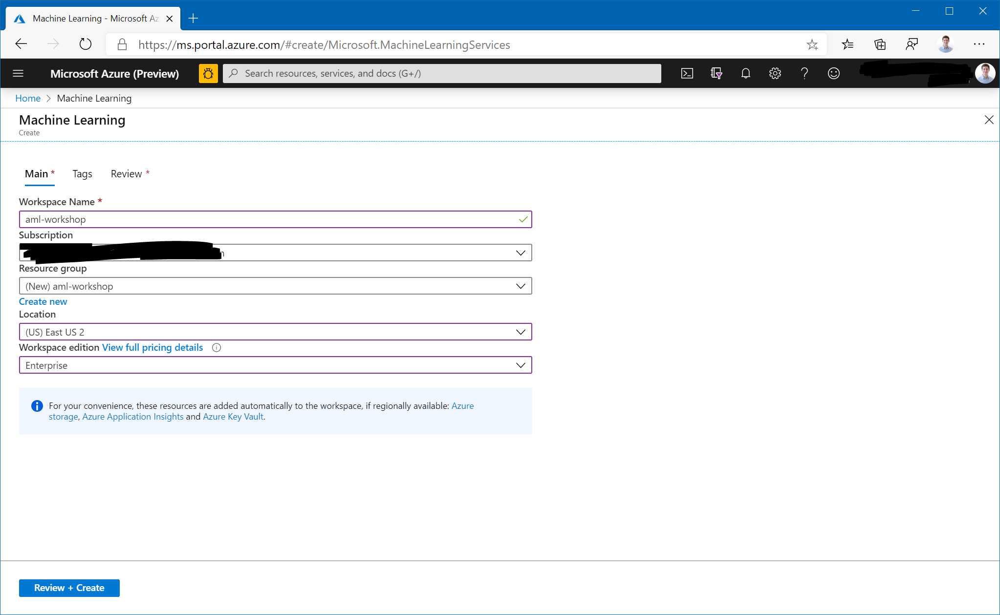
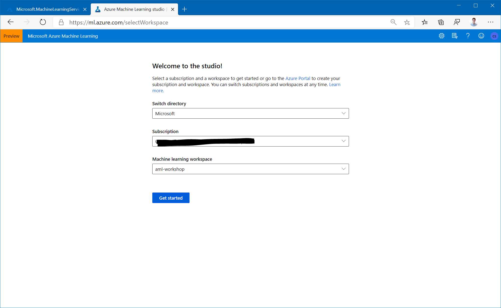
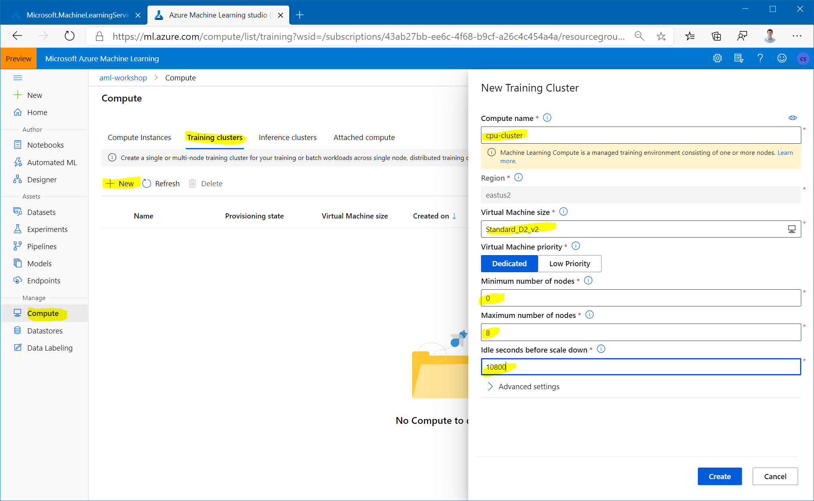
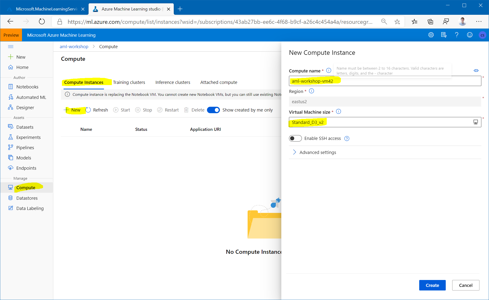

# Setting up the Compute Targets

## Prerequisites

To run through this workshop, you will need an Azure subscription and an Azure ML workspace. See instructions on how to create a workspace [here](https://docs.microsoft.com/en-us/azure/machine-learning/service/how-to-manage-workspace) and make sure to select `Enterprise` edition.

:star: If you want to have this workshop go smooth, then:

- Name your AzureML workspace `aml-workshop`
- Name the resource group of the workshop `aml-workshop`

Navigate to [`https://ml.azure.com/`](https://ml.azure.com/) and select your newly created workspace.

## Creating an AzureML compute cluster

We will do a number of actions that require a compute target to be exectuted on. We will start by creating a cluster of CPU VMs.

1. Navigate to `Compute` > `Training Clusters` in the `Manage` section and click `New`.

1. Call the cluster `cpu-cluster`.
    - For machine size choose `Standard_D2_v2` (that is an inexpensive general purpose VM size at about $0.11/hour in `eastus2`). 
    - Set the `Minimum number of nodes` to 0 and the the `Maximum number of nodes` to 4. That way the cluster will scale automatically to up to 4 nodes as jobs require them.
    - Set the `Idle seconds before scale down` to 10800. That means that nodes will be kept around for 3 hours before they are spun down. That way, during our workshop, jobs won't have to wait for spin-up. Make sure that number is lower if you are using a more expensive VM size.

## Creating an AzureML Compute Instance

Next, we will create an Compute Instance. The Compute Instance will serve as an interactive workstation in the cloud that serves as a Jupyter server, but also hosts and instance of RStudio server and can run TensorBoard, Bokeh, Shiny or other apps used during the developement work of a Data Scientist.

1. Navigate to `Compute Instances` tab in the `Compute` section and click on `New`.
 
1. Choose some sufficiently unique name, keep the default VM type (`STANDARD_D3_V2` - a fairly inexpensive machine type costing about $0.22/hour in `eastus2`) and click `Create`:

See [here](https://docs.microsoft.com/en-us/azure/machine-learning/how-to-configure-environment#compute-instance) for details on creating Compute Instances.

**Note that this machine will keep running until you stop it!**
