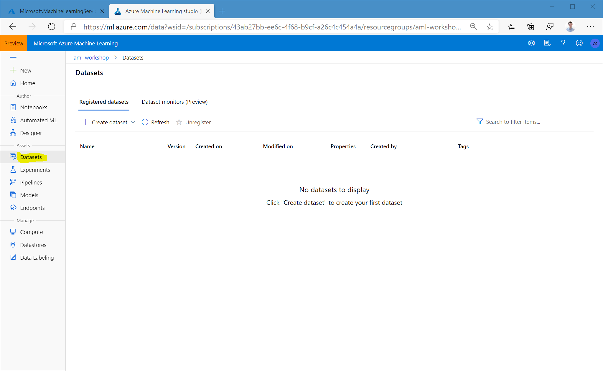
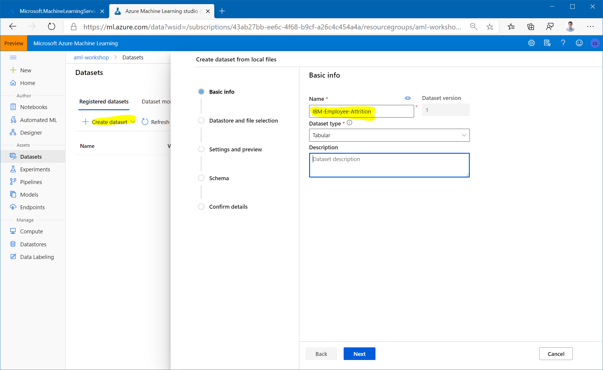
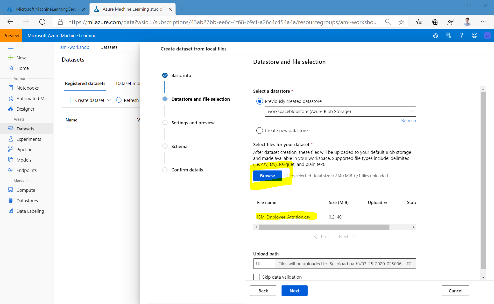
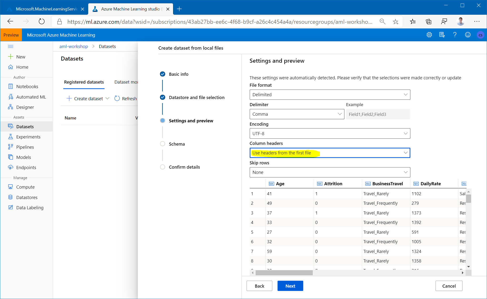
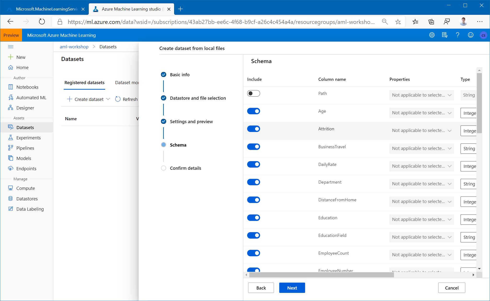
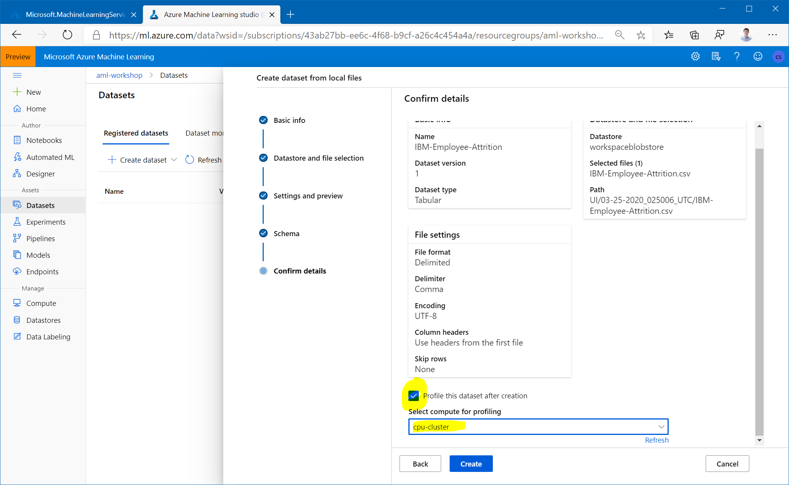
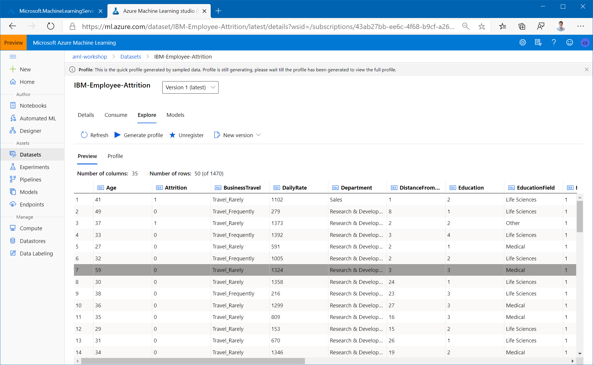
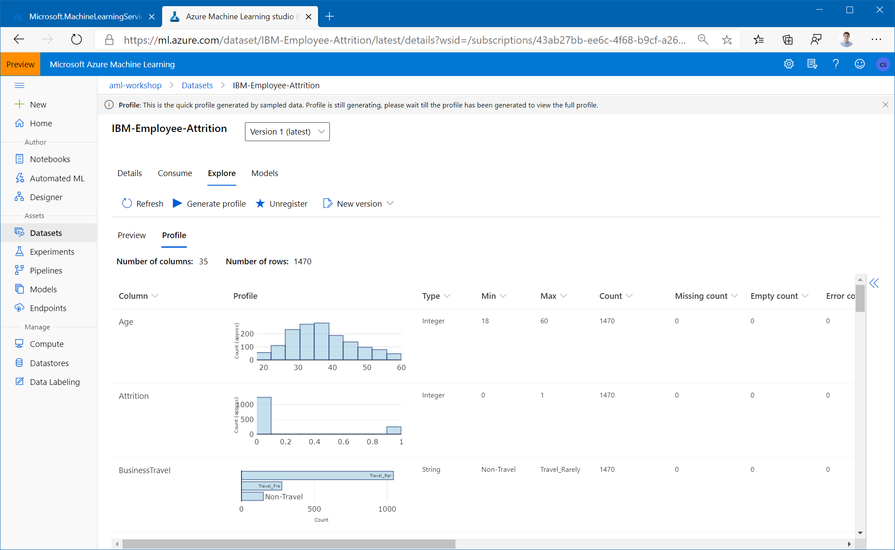
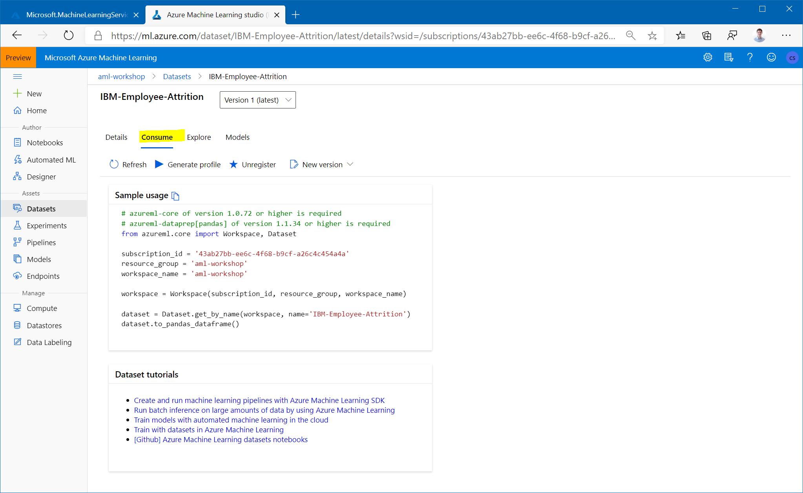

# Datasets and Datastores

The [AzureML studio](https://ml.azure.com) allows the user to manage their dataset and datastores directly inside the portal. 

A Dataset is a resource for exploring, transforming and managing data in Azure Machine Learning. 
Datasets enable:

- Easy access to data: without worrying about connection strings or data paths. Only keep a single copy of data in the storage service of your choice.

- Training with big data: seamless integration with Azure Machine Learning features like labelling, training products and pipelines. Users can share and reuse datasets in various experiments.

- Tracking data usage: Azure ML automatically tracks which version of the dataset was used for the ML experiment and produced which model.

## Uploading a Dataset to AzureML studio

:star: Download dataset: [IBM-Employee-Attrition.csv](https://raw.githubusercontent.com/csiebler/azureml-workshop-2020/master/data/IBM-Employee-Attrition.csv)

1. Download the IBM Attrition dataset by clicking on this link: [IBM-Employee-Attrition.csv](https://raw.githubusercontent.com/csiebler/azureml-workshop-2020/master/data/IBM-Employee-Attrition.csv) and save the file to disk.

1. Goto the [AzureML studio](https://ml.azure.com)

1. Navigate to the left pane of your workspace. Select `Datasets` under the `Assets` section. 

1. Click on `Create dataset` and choose 'From local files'. Name the dataset `IBM-Employee-Attrition` and then click `Next`. Make sure to leave the dataset type as Tabular.

1. Click `Browse`, choose the file you had downloaded, and click `Next` to create the dataset in the workspace's default Blob storage.

1. Make sure to select `Use headers from the first file` under `Column headers`. Click `Next` through the following. Make sure the `Schema` section looks good before continueing.

1. Finally, in the `Confirm Details` section, select `Profile this dataset after creation` and specify the `cpu-cluster` that you previously created as the compute to use for profiling.

## Explore the dataset

1. Now, click on the newly created dataset and click `Explore`. Here you can see the fields of the Tabular dataset.

1. To view the profile of the dataset we generated in the previous step, click the `Profile` tab. If you want to regenerate a profile (or you created the dataset without selecting the profile option), you can click `Generate profile` and select a cluster to generate profile information for the dataset.

1. In the `Consume` tab we can find a short code snippet for consuming the dataset.

For more information on datasets, see the [how-to for more information on creating and using Datasets](https://docs.microsoft.com/en-us/azure/machine-learning/service/how-to-create-register-datasets).
