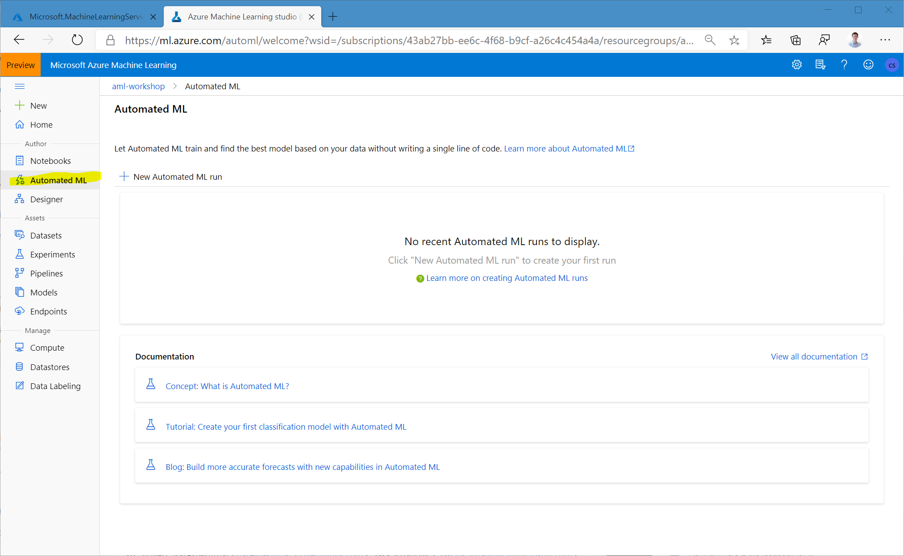
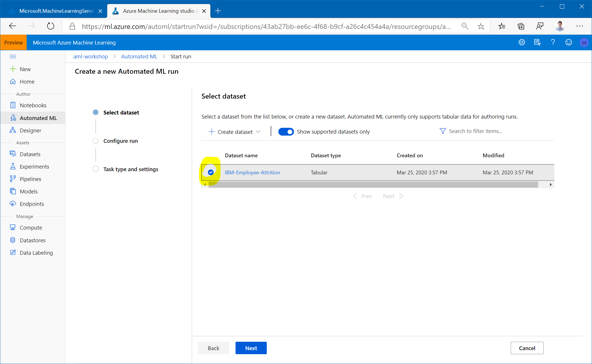
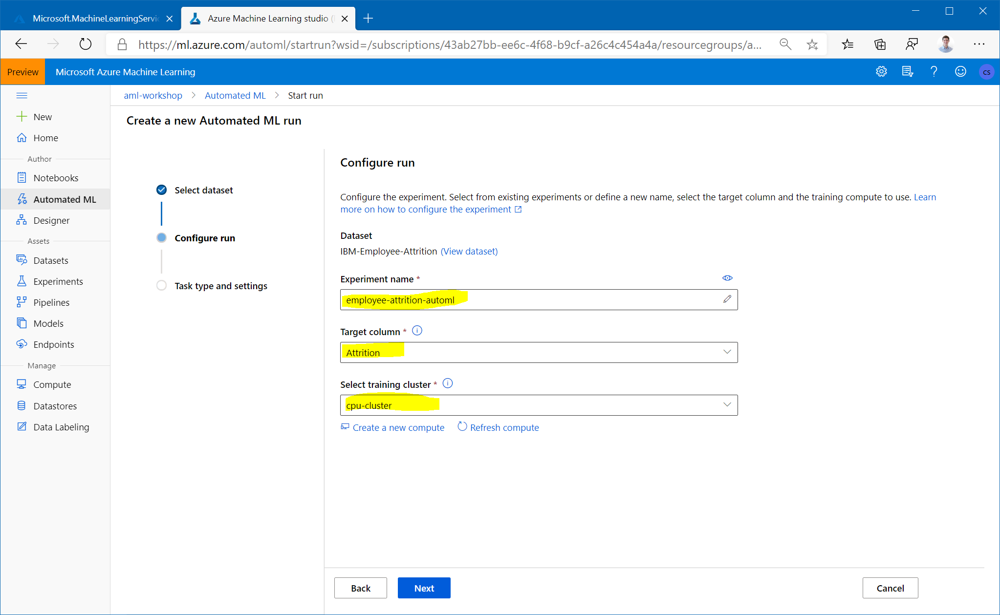
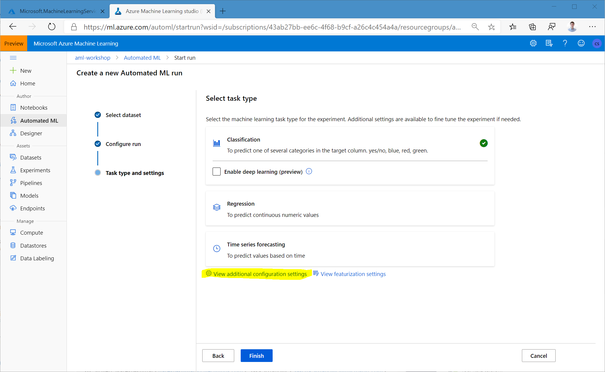
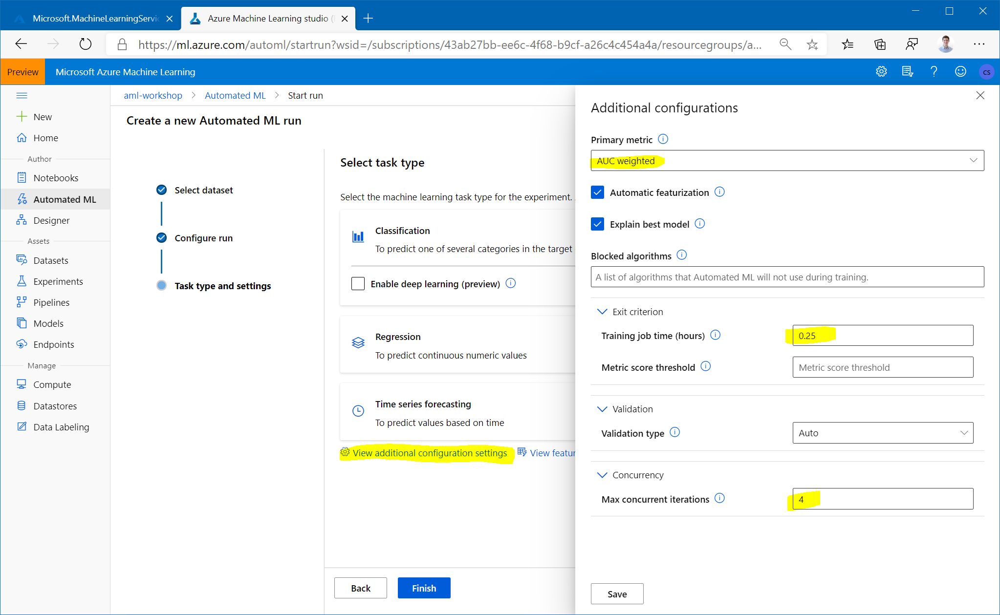
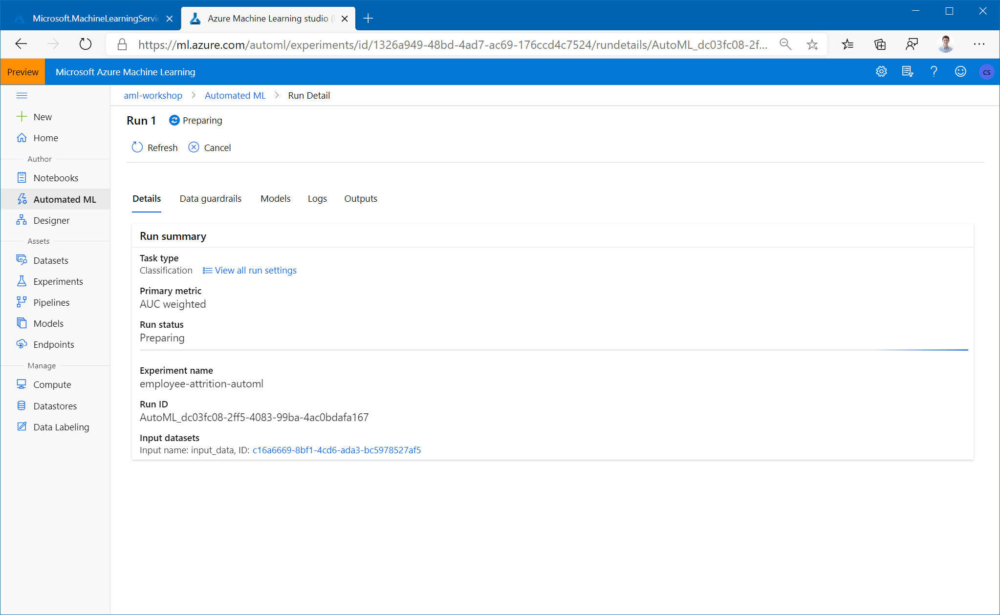

# Automated Machine Learning

Automated machine learning (automated ML) builds high quality machine learning models for you by automating model and hyperparameter selection. Bring a labelled dataset that you want to build a model for and automated ML will give you a high quality machine learning model that you can use for predictions.

If you are new to Data Science, automated ML will help you get jumpstarted by simplifying machine learning model building. It abstracts you from needing to perform model selection, hyperparameter selection and in one step creates a high quality trained model for you to use.

If you are an experienced data scientist, automated ML will help increase your productivity by intelligently performing the model and hyperparameter selection for your training and generates high quality models much quicker than manually specifying several combinations of the parameters and running training jobs. Automated ML provides visibility and access to all the training jobs and the performance characteristics of the models to help you further tune the pipeline if you desire.

## Using Automated Machine Learning

Follow the instructions in the [documentation](https://docs.microsoft.com/en-us/azure/machine-learning/how-to-use-automated-ml-for-ml-models) for a full overview of the user interface.

1. Navigate to the left pane of your workspace. Select `Automated ML` under the `Author` section.

1. Select `New Automated ML run` and select the `IBM-Employee-Attrition` dataset that you had created earlier.

1. Enter the `Experiment name`, select the target column `Attrition` (this is what we want to predict), and select the cluster `cpu-cluster` which you've created earlier.

1. Click `Next` and select `View additional configuration settings`.

1. Set the `Primary metric` to `AUC_weighted`, the training job time to `0.25` and `Max concurrent iterations` to `4` (sufficient for the workshop). The concurrency parameter defines how many nodes of your cluster will be used for training.

1. Hit `Finish` and wait for the training job to start. You'll be able to see the models which are created during the run, click on any of the models to open the detailed view of that model, where you can analyze the [graphs and metrics](https://docs.microsoft.com/en-us/azure/machine-learning/service/how-to-understand-automated-ml).

1. Once the run is completed, click `Deploy best model` to create a deployed endpoint from the model.

To learn more about automated ML, see documentation [here](https://docs.microsoft.com/en-us/azure/machine-learning/service/concept-automated-ml).

Optional Tasks:
- Once your model has been deployed, follow these [instructions](https://docs.microsoft.com/en-us/power-bi/service-machine-learning-integration) to consume the model from Power BI.

- Try the [sample notebooks](https://github.com/Azure/MachineLearningNotebooks/tree/master/how-to-use-azureml/automated-machine-learning).