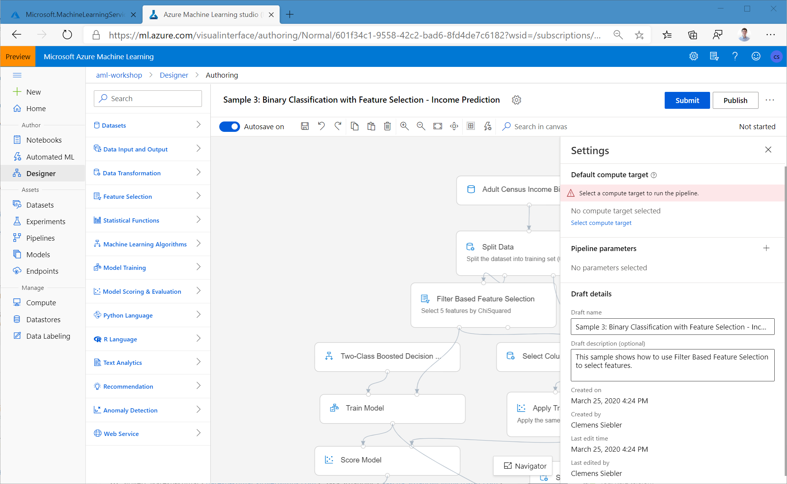
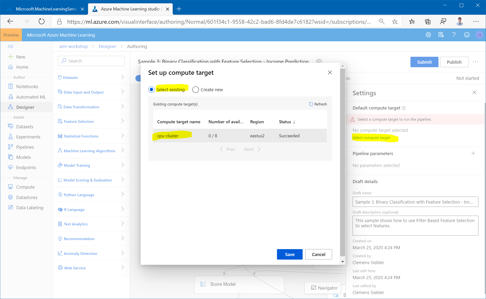
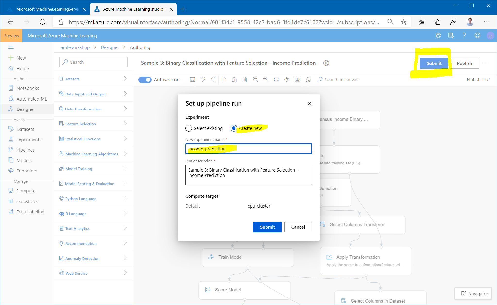
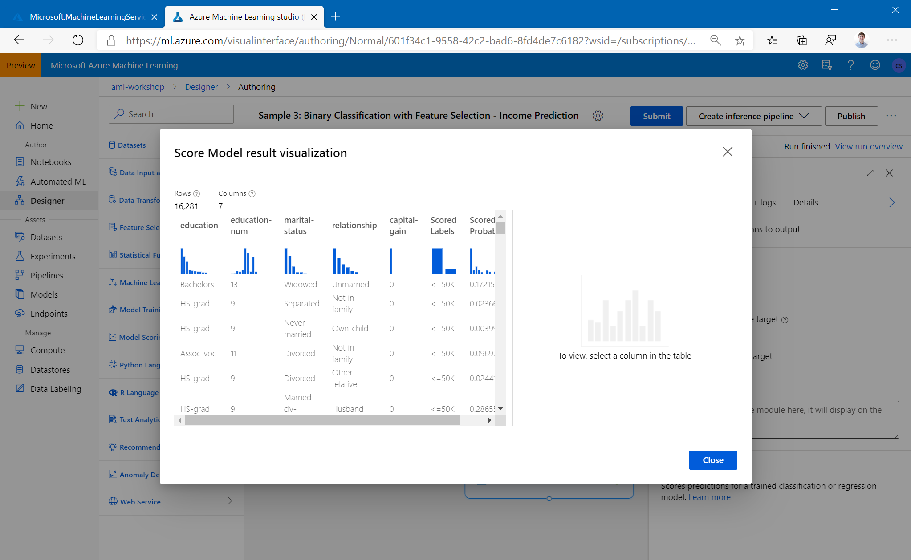

# The AzureML Visual Interface: Designer (Preview)

1. In the AzureML studio, navigate to the `Designer` tab under the `Author` section and launch it. 

1. Create a new experiment by opening `Sample 3: Binary Classification with Feature Selection - Income Prediction`.

1. The graph for the sample experiment will open. Click `Select compute target` on the right and select your `cpu-cluster`. 

1. Explore the graph and try to understand what it is doing.

1. Click `Submit` at the top and give your experiment a name.

1. Once you ran the experiment, you can inspect the outputs of the individual steps - check out the output of the different steps, in particular the last one by right-clicking it and selecting `Vizualize Scored dataset`.

**Optional Task:** Create and run an experiment that trains a model to predict attrition using the IBM Attrition Dataset you had uploaded earlier.
