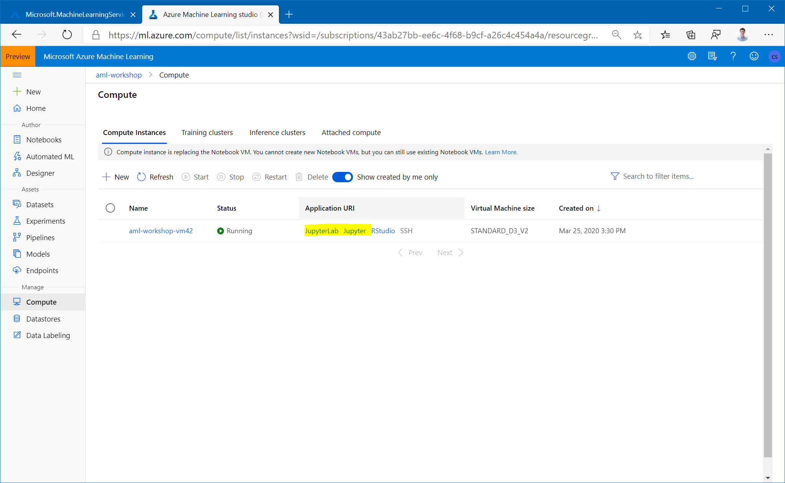

# Clone git Repository to Workspace storage

For the following parts of the workshop, you are going to work on the Compute Instance you provisioned [earlier](1-setup-compute.md). For that, you will need to clone this git repository onto the workspace.

1. To get started, first navigate to the JupyterLab instance running on the Notebook VM by clicking on the JupyterLab link shown below:


1. After going through authentication, you will see the JupyterLab frontend. As you authenticate, make sure to use the same user to log in as was used to create the Compute Instance, or else your access will be denied. Next open an Terminal (either by `File -> New -> Terminal`, or by just clicking on `Terminal` in the Launcher Window).


1. In the terminal window clone this repository by typing:

```
git clone https://github.com/csiebler/azureml-workshop-2020
```

