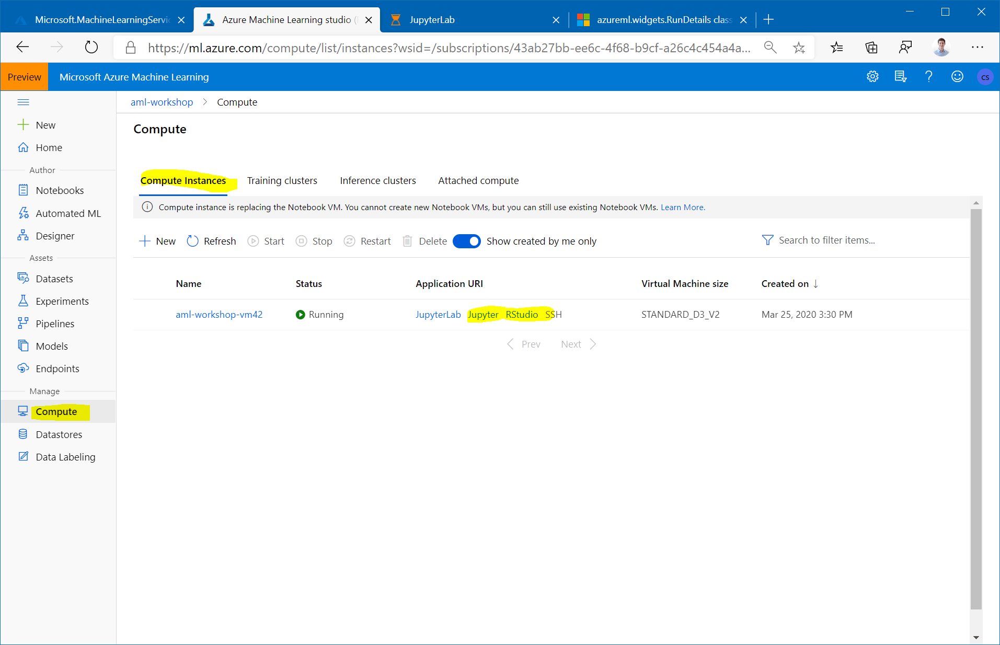
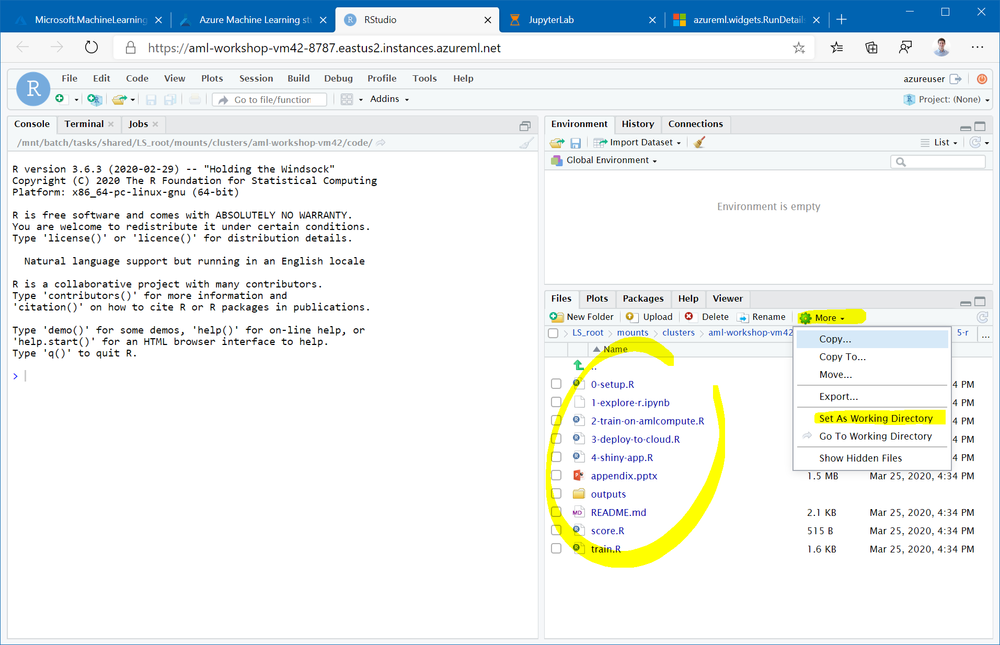

## Azure ML and R

This module will show how to use Azure ML with R. The Azure ML SDK for R is available today in public preview. The SDK is open-sourced and developed on [GitHub](https://github.com/Azure/azureml-sdk-for-r) and also available on [CRAN](https://cran.r-project.org/web/packages/azuremlsdk/index.html).

In this module we will be using both the Jupyter and the RStudio instances that are installed on the [Compute instance](https://docs.microsoft.com/en-us/azure/machine-learning/concept-compute-instance) you set up in the [first module](../1-workspace-concepts/1-setup-compute.md) of the workshop.

### Part 0: Setup

From the "Compute instances" tab in [AzureML studio](ml.azure.com), open the `Jupyter` link to launch Jupyter on your compute instance. Navigate to the `5-r/0-setup.R` notebook and run through the notebook.

If you get a `Would you like to install Miniconda? [Y/n]` prompt please enter `n`.

### Part 1: Explore in Jupyter

Navigate to the `1-explore-r.ipynb` notebook and run through the notebook.

### Part 2: Train a model on AmlCompute

From the "Compute instances" tab in [AzureML studio](ml.azure.com), open the `RStudio` link under "Application URI" to launch RStudio web interface on your compute instance. Once in RStudio, in the bottom right tab "Files" navigate to `code/` and then where you cloned this repo to, for instance `code/azureml-workshop-2020`. Open `2-train-on-amlcompute.R`.

Prior to running the script, set the working directory to the current file location using `setwd(dirname)`, or `Session -> Set Working Directory -> To Source File Location`, or `More -> Set As Working Directory`.

You can step through the code by using `CRTL+Enter`.
Again, if you get a `Would you like to install Miniconda? [Y/n]` prompt please enter `n`.

### Part 3: Deploy the model as a web service

In RStudio, open `3-deploy-to-cloud.R` and run through this script.

### Part 4: Use the deployed endpoint in a Shiny app

In RStudio, open `4-shiny-app.R` and run through this script.
